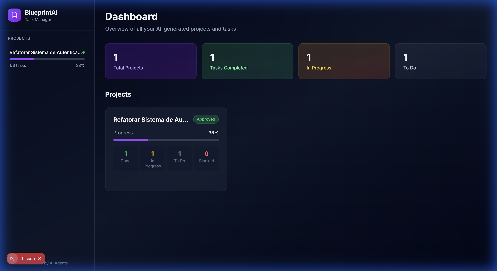
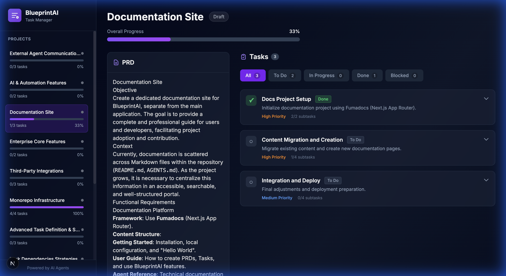

<p align="center">
  
</p>

<h1 align="center">BlueprintAI</h1>

<p align="center">
  <strong>AI-powered PRD & task management system</strong>
</p>

<p align="center">
  Transform AI-generated PRDs into beautiful, trackable tasks
</p>

<p align="center">
  <a href="#features">Features</a> •
  <a href="#quick-start">Quick Start</a> •
  <a href="#for-ai-agents">For AI Agents</a> •
  <a href="#tech-stack">Tech Stack</a> •
  <a href="#roadmap">Roadmap</a>
</p>

---

## ✨ Features

- 🤖 **AI-First Design** - Structured markdown format optimized for AI agents to generate PRDs and tasks
- 📋 **PRD Management** - Beautiful rendering of Product Requirements Documents with status tracking
- ✅ **Task Tracking** - Hierarchical tasks with subtasks, priorities, and status filters
- 🎨 **Premium UI** - Dark theme with glassmorphism effects, smooth animations, and responsive design
- 📊 **Dashboard** - Overview of all projects with progress stats and metrics
- 🔄 **Real-time Updates** - Hot reload when markdown files change during development

## 📸 Screenshots

<p align="center">
  
  <br>
  <em>Dashboard with project overview and stats</em>
</p>

<p align="center">
  
  <br>
  <em>Project detail with PRD and expandable tasks</em>
</p>

## 🚀 Quick Start

### Prerequisites

- Node.js 18+
- pnpm (recommended) or npm

### Installation

```bash
# Clone the repository
git clone https://github.com/1001Josias/blueprint-ai.git
cd blueprint-ai

# Install dependencies
pnpm install

# Start development server
pnpm dev
```

Open [http://localhost:3000](http://localhost:3000) to see the app.

### Creating Your First Project

1. Create a new directory in `projects/`:
   ```bash
   mkdir -p projects/my-project
   ```

2. Create `prd.md` with your PRD:
   ```markdown
   ---
   id: "my-project"
   title: "My Awesome Project"
   status: "draft"
   version: "1.0"
   created_at: "2026-01-05"
   updated_at: "2026-01-05"
   author: "ai-agent"
   ---

   # My Awesome Project

   ## Objetivo
   Description of what this project aims to achieve...
   ```

3. Create `tasks.md` with your tasks:
   ```markdown
   ---
   project_id: "my-project"
   prd_version: "1.0"
   created_at: "2026-01-05"
   updated_at: "2026-01-05"
   ---

   # Tasks: My Awesome Project

   ## Task 1: First Task
   - **id:** task-001
   - **status:** todo
   - **priority:** high
   - **description:** Description of the task.

   ### Subtasks

   #### [ ] First subtask
   Description of what needs to be done.
   ```

4. Refresh the browser to see your project!

## 🤖 For AI Agents

BlueprintAI is designed to work seamlessly with AI coding assistants. See [AGENTS.md](AGENTS.md) for:

- Setup commands and code style
- PRD and Tasks markdown schemas
- Git conventions and PR instructions

### Quick Reference

| Field | PRD Values | Task Values |
|-------|------------|-------------|
| **Status** | `draft`, `in_review`, `approved`, `rejected` | `todo`, `in_progress`, `done`, `blocked` |
| **Priority** | - | `low`, `medium`, `high`, `critical` |

## 📁 Project Structure

```
blueprint-ai/
├── content/
│   └── projects/              # Your projects live here
│       └── example-project/
│           ├── prd.md         # Product Requirements Document
│           └── tasks.md       # Tasks derived from PRD
├── src/
│   ├── app/                   # Next.js App Router
│   │   ├── layout.tsx         # Root layout with sidebar
│   │   ├── page.tsx           # Dashboard page
│   │   └── projects/[slug]/   # Dynamic project pages
│   ├── components/            # React components
│   │   ├── sidebar.tsx        # Navigation sidebar
│   │   ├── project-card.tsx   # Project card for dashboard
│   │   ├── task-list.tsx      # Task list with filters
│   │   └── task-item.tsx      # Individual task with subtasks
│   └── lib/
│       ├── schemas.ts         # Zod validation schemas
│       ├── markdown.ts        # Markdown parsing utilities
│       └── utils.ts           # General utilities
├── AGENTS.md                  # Instructions for AI agents
└── package.json
```

## 🛠️ Tech Stack

| Category | Technology |
|----------|------------|
| **Framework** | [Next.js 15](https://nextjs.org/) (App Router) |
| **Language** | [TypeScript](https://www.typescriptlang.org/) |
| **Styling** | [Tailwind CSS](https://tailwindcss.com/) |
| **Markdown** | [gray-matter](https://github.com/jonschlinkert/gray-matter) + [remark](https://github.com/remarkjs/remark) |
| **Validation** | [Zod](https://zod.dev/) |
| **Package Manager** | [pnpm](https://pnpm.io/) |

## 🗺️ Roadmap

## 🗺️ Roadmap & Projects

BlueprintAI is built by BlueprintAI. We use our own system to manage our roadmap.
Check out the defined projects below:

### Core Definitions (New!)
- [**Workspaces & Access Control**](content/projects/workspaces/prd.md) - The "House" concept for isolation.
- [**Task Dependencies**](content/projects/task-dependencies/prd.md) - Blockers and prerequisites.
- [**External Agent API**](content/projects/agent-communication/prd.md) - allowing agents to work together.
- [**Advanced Task Schema**](content/projects/task-definition/prd.md) - Types, sizing, acceptance criteria.
- [**Task Drag & Drop**](content/projects/task-drag-and-drop/prd.md) - Reordering tasks visually.

### Upcoming Features
- [**UI Editing & Interactivity (v1.1)**](content/projects/ui-editing/prd.md) - Edit tasks without Markdown.
- [**Integrations (v1.2)**](content/projects/integrations/prd.md) - GitHub, Jira, Linear sync.
- [**Enterprise Core (v2.0)**](content/projects/enterprise-core/prd.md) - Multi-user, DB, Real-time.
- [**AI & Automation**](content/projects/ai-features/prd.md) - Smart estimates and generation.

---

<p align="center">
  Made with 💜 by Josias Junior
</p>

